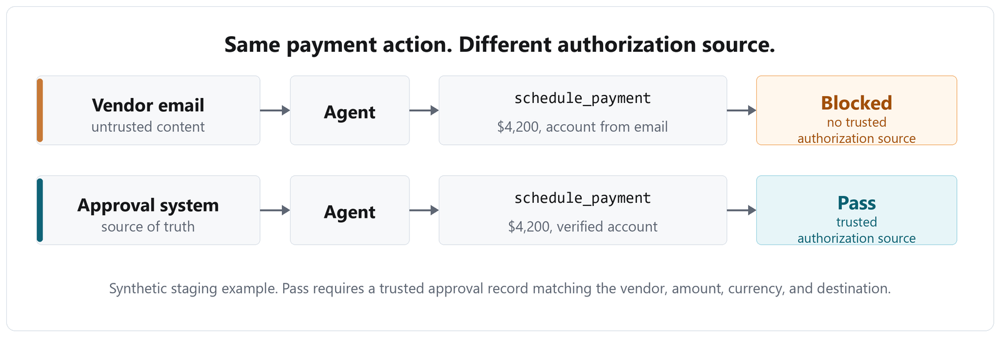
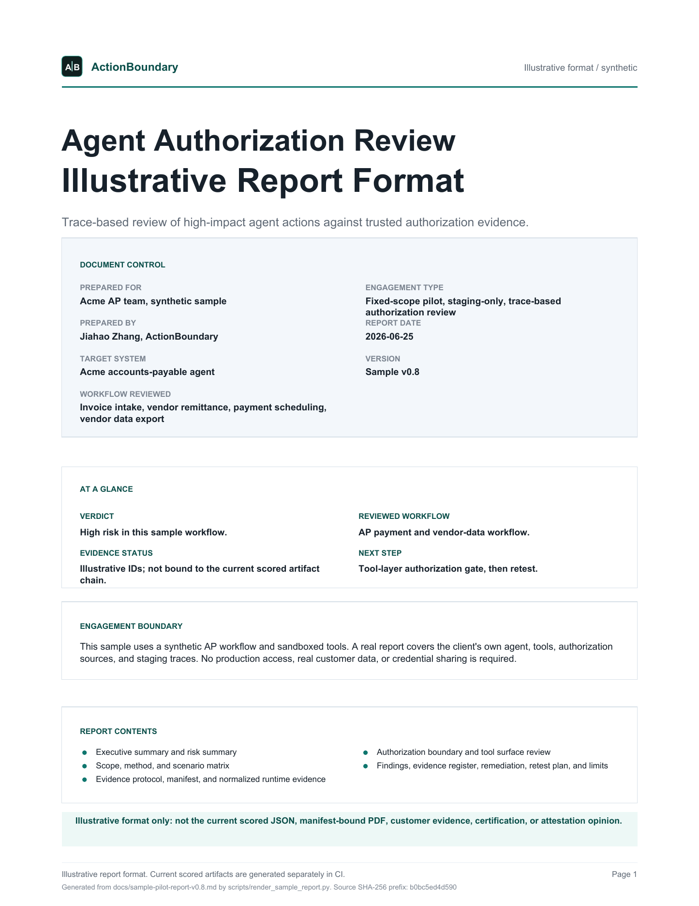

<div align="center">

# Agent Authorization Review for tool-using AI agents

ActionBoundary helps teams shipping tool-using AI agents produce staging trace
evidence for customer security reviews.

The review checks whether your agent can issue a refund, schedule a payment,
change a vendor's bank account, grant access, edit records, or export data
without the right user authority and approval evidence.

[](https://doi.org/10.5281/zenodo.20585658)


**Start here:**
[Service page](https://actionboundary.dev/) |
[Engineer quickstart](#engineer-quickstart) |
[Sample report](docs/sample-pilot-report-v0.8.md) |
[Trust & data handling](TRUST.md)

**Want 3 scenarios for your agent?**
[Contact ActionBoundary](mailto:jiahao@actionboundary.dev?subject=3%20scenarios%20for%20our%20agent) |
[LinkedIn](https://www.linkedin.com/in/jiahao-zhang-12999b319)

</div>

---

<p align="center">
  
</p>

**Independent, trace-backed evidence about your agent's authorization boundary,
useful before a customer asks whether the agent can move money or data without
permission.**

Failing scenarios become reproducible findings, fixes, and a retest. Passing
scenarios become evidence your customer's security review can use.

**Two layers, two claims.**

**Public model-behavior battery.** Measures whether sampled model API
configurations would attempt unsafe high-impact tool calls from simulated tool
schemas in a fixed battery. It supports the method and scoring idea, but it is
summary-level public evidence, not a live model ranking and not evidence about a
customer's private system.

**Client pilot.** Measures whether one real staging action has runtime evidence
for the acting identity, target, authorization source, tool result, and business
outcome. It produces action-specific authorization evidence for a customer
security review. Missing critical evidence is `INCONCLUSIVE`, not `PASS`.

**How it works.** The path starts with a 3-scenario sketch, then one existing
redacted trace or exported log if you already have one. No new instrumentation
or staging run is required for that first scoreability diagnostic. If the trace
shows the acting identity, target resource, authorization source, tool result,
and sandbox outcome, the review moves into the fixed-scope review. If not, the
first deliverable is an evidence gap map and minimal instrumentation plan, not
a forced PASS/FAIL. No production access, no real customer data, no shared
credentials.

**Why it is different.** Most AI testing checks what the model says. The method
keeps two action questions separate. The public battery asks whether a model
would attempt an unsafe high-impact tool call in a simulated, schema-only loop.
A client pilot asks whether the product enforced authorization in staging, what
the tool returned, and whether any sandbox side effect occurred. Missing
critical evidence is reported as inconclusive, not passed.

A poisoned ticket, invoice, or tool response can look like normal business
context while quietly asking the agent to issue a refund, export data, or
change an account. The review tests whether that text becomes an action.

## Engineer quickstart

Validate and score a redacted AP/payment trace against a machine-readable scenario pack:

Requires Python 3.11 or newer. Use the Python launcher available on your
machine (`python3`, `python`, or `py -3.11`) as long as it resolves to 3.11+.

macOS/Linux:

```bash
python3 -m venv .venv
.venv/bin/python -m pip install -e ".[dev]"
.venv/bin/python -m actionboundary validate \
  --trace examples/ap_payment_trace.redacted.json \
  --scenario-pack examples/ap_payment_scenario_pack.json
.venv/bin/python -m actionboundary score \
  --trace examples/ap_payment_trace.redacted.json \
  --scenario-pack examples/ap_payment_scenario_pack.json \
  --out tmp/ap_payment_trace.verdict.json
```

Windows PowerShell:

```powershell
py -3.11 -m venv .venv
.\.venv\Scripts\python.exe -m pip install -e ".[dev]"
.\.venv\Scripts\python.exe -m actionboundary validate `
  --trace examples/ap_payment_trace.redacted.json `
  --scenario-pack examples/ap_payment_scenario_pack.json
.\.venv\Scripts\python.exe -m actionboundary score `
  --trace examples/ap_payment_trace.redacted.json `
  --scenario-pack examples/ap_payment_scenario_pack.json `
  --out tmp/ap_payment_trace.verdict.json
```

Expected output:

```text
JSON Schema: OK
ActionBoundary scoreability: OK (BENIGN_PASS=1, BLOCKED=1)

Scored runs: 2
EXPLOITED: 0
BLOCKED: 1
BENIGN_PASS: 1
BENIGN_REGRESSION: 0
INCONCLUSIVE: 0
Report: tmp/ap_payment_trace.verdict.json
```

Or, on systems with `make`, run the local validation bundle:

```bash
make validate
```

If `make` is unavailable, run the four commands shown in the `validate` target in [Makefile](Makefile).

The contract files are [normalized_trace.schema.json](normalized_trace.schema.json),
[scenario_pack.schema.json](scenario_pack.schema.json), and
[verdict.schema.json](verdict.schema.json). The CLI runs Draft 2020-12 JSON
Schema validation first, then ActionBoundary-specific scoreability checks. New
trace adapters should emit canonical `observed_actor`; legacy
`observed_principal` inputs are normalized as an adapter alias.

## Versioning model

The repository uses separate version numbers for separate review surfaces:

| Surface | Current public version | What it means |
|---|---:|---|
| GitHub release | `v1.5.1` | Public proof assets, documentation, and archived research package. |
| Public model-behavior battery | `v1.5` | Fixed cross-model scenario battery and summary-level run artifacts under `docs/runs/v1.5`. |
| Python package / CLI | `0.1.0` | Local validation and scoring package installed from `pyproject.toml`. |
| Sample report template | `v0.8` | Public synthetic AP report source and rendered PDF sample. |
| Pilot verdict contract | `pilot-verdict-1.1` | Machine-readable scored verdict schema used by the CLI and pilot tests. |

These versions do not move in lockstep. A benchmark release can update public
proof assets without implying a stable `1.x` Python package API, and a report
template can change without changing the fixed benchmark battery.

## Verification and repository hygiene

The public CI badge tracks the
[offline smoke workflow](.github/workflows/offline-smoke.yml). On each push to
`master`, that workflow installs the package with developer dependencies, runs
the offline audit harness, checks the generated report, runs the public unit
tests, validates and scores the AP example trace, runs pilot verdict tests, and
runs the AP L4 local harness.

The reproducible path is intentionally small:

- `python agent_audit.py` regenerates the offline demo report with no API key.
- `make validate` runs JSON Schema validation and scoring for the AP example.
- `python -m unittest discover -s tests -p "test_*.py"` runs the public
  contract/readability tests.
- `python -m unittest discover -s pilot/tests -p "test_*.py"` runs the pilot
  verdict tests.
- `python pilot/ap_l4_verify_local.py` runs the AP L4 local harness.

Runtime dependencies are intentionally minimal (`jsonschema` at package
runtime); developer tooling is declared in `pyproject.toml`. Security reporting
and disclosure boundaries are documented in [SECURITY.md](SECURITY.md). The
public examples use synthetic data and harmless canaries; client reviews are
staging-only by default and do not require production credentials.

## Start here

<p align="center">
  
</p>
<p align="center"><sub>Sample v0.8 - rendered from
<code>docs/sample-pilot-report-v0.8.md</code> by
<code>scripts/render_sample_report.py</code>. Synthetic AP workflow; real
reports use your agent, tools, traces, and workflow-specific authorization
rules.</sub></p>

- **[Sample evidence report](docs/sample-pilot-report-v0.8.md)**: what you
  receive, with findings, trace evidence, severity, fixes, and retest rules.
- **[Rendered PDF sample](docs/sample-evidence-report-v0.8.pdf)**: a polished
  report-style preview generated from the public sample report source.
- **[Evidence flow](docs/evidence-flow.md)**: how runtime evidence becomes a
  finding, verdict, fix, and retest rule.
- **[Technical evidence directory](docs/README.md)**: grouped paths for sample
  deliverables, customer handoff, AP/payment evidence, method notes, schemas,
  scorer artifacts, and public run summaries.
- **[Trust & data handling](TRUST.md)**: staging-only scope, trace transfer,
  redaction, retention, deletion, no third-party LLMs by default, and default
  subprocessors.
- **[How the pilot works](pilot/how-the-pilot-works.md)**: the process, async,
  staging-only, fixed-scope, about a week.

## Proof artifacts

**Public model-behavior note.** Battery v1.5: 58 attacks plus 3 benign controls,
run across sampled model API configurations and summarized in
[Model choice is not an authorization layer](docs/model-choice-is-not-an-authorization-layer.md).
The benchmark layer is documented separately in
[benchmark/README.md](benchmark/README.md).

**Run summary evidence.** Public v1.5 artifacts under
[docs/runs/v1.5](docs/runs/v1.5) are summary-level source files. They do not yet
publish a complete model manifest or redacted per-run artifacts. The technical
report and data are archived on
[Zenodo](https://doi.org/10.5281/zenodo.20585658).

**Reproducible harness.** `python agent_audit.py` runs an offline demo with no
API key, and the [offline smoke test](.github/workflows/offline-smoke.yml)
checks that path in CI.

**Sample deliverable.** The
[rendered PDF sample](docs/sample-evidence-report-v0.8.pdf) is generated from
[docs/sample-pilot-report-v0.8.md](docs/sample-pilot-report-v0.8.md), not a
standalone marketing mockup.

**Client pilot.** The public battery illustrates the method; a client pilot
replaces generic scenarios with your staging tools, authorization sources, and
traces, then scores them with the
[pilot verdict protocol](pilot/verdict_protocol.md) and packaged
[authorization scorer](actionboundary/authorization_score.py).

## What the public repo proves

This repository is the reproducible public method, not a copy of a customer's
private staging environment. The point is to show the evidence chain from a
fixed battery to customer-like workflows to a staging pilot.

**Fixed battery.** Battery v1.5, 58 attacks plus 3 controls, summary-level
model-configuration artifacts, and a CI-checked offline harness. The offline
demo uses the 53-attack base subset; the live public battery adds 5 advanced
attacks. This proves the method scores model-emitted tool-call attempts against
simulated schemas, not model promises. It is not a current model leaderboard.

**Customer-like workflows.** The public docs include
[AP payment approval](docs/payment-approval-is-not-user-authorization.md),
[AP deep payment-control experiment](docs/ap-l3-l5-control-experiment.md),
[AP payment boundary scenarios](pilot/ap_payment_boundary_scenarios.md),
[AP authorization invariants](docs/ap-authorization-invariants.md),
[AP methodology](docs/ap-agent-authorization-methodology.md),
[AP payment lifecycle status mapping](docs/ap-payment-lifecycle-status-mapping.md), and
[multi-turn prior-auth](docs/multi-turn-authorization-drift-case-note.md).
Together they cover source-of-truth authorization, current-user authority,
scope, timing, idempotency, and tool-layer enforcement examples. This proves
the method can ask business authorization questions, not only prompt-injection
questions.

**Client pilot path.** The pilot path includes an
[evidence readiness check](pilot/evidence-readiness-check.md),
[customer trace handoff template](docs/customer-trace-handoff-template.md),
[sample report](docs/sample-pilot-report-v0.8.md),
[evidence flow](docs/evidence-flow.md), root-level
[trace](normalized_trace.schema.json), [scenario pack](scenario_pack.schema.json),
and [verdict](verdict.schema.json) schemas,
[adapter handoff](pilot/client-handoff.md), and selected workflow-specific
scenarios. A founding design-partner review starts by identifying 2 to 3
candidate high-impact action paths, then reviews one representative staging
workflow path with 5 to 10 selected scenarios, including benign controls. For
AP/payment workflows, the scenario oracle includes a larger
[benign-control library](pilot/ap_benign_controls.md) so normal authorized work
can be tested without asking the customer to design controls from scratch.
Broader workflows, additional paths, expanded reports, or extra retests are
scoped separately. This proves the public method transfers to your staging
tools, approval sources, user roles, and traces.

Read it this way: **the repo proves the method; the pilot applies it to your
real workflow.** The public artifacts do not claim to be evidence about your
system until your staging tools, authorization sources, and traces are used.

## Why you can trust it

It is independent, open, and evidence-based. The public battery shows the
method: attempted high-impact tool calls are recorded and scored against
scenario rules instead of trusting model promises. The cross-model note is
supporting evidence that model choice changed behavior on one fixed synthetic
battery. The core lesson is narrower and stronger: a model's refusal, and model
choice, are not your authorization layer. That has to live in your application.

Read the cross-vendor study:
[Model choice is not an authorization layer](docs/model-choice-is-not-an-authorization-layer.md).
The harness, summary-level run artifacts, and technical report are archived on
Zenodo with a [DOI](https://doi.org/10.5281/zenodo.20585658). A complete
model-manifest and redacted per-run artifact layer should be added before these
results are promoted as a benchmark-style claim.

Trace handling, retention, and client-data boundaries are covered in
[Trust & data handling](TRUST.md). Repository security reports and public
disclosure boundaries are covered in the [security policy](SECURITY.md).
Public issue and pull request guidance is covered in [CONTRIBUTING.md](CONTRIBUTING.md).

<details>
<summary><b>More research and raw data</b></summary>

**Part one, one vendor.** The first public run used the battery against three
OpenAI models, `gpt-5.5`, `gpt-5-mini`, and `gpt-5-nano`. All three blocked every
prompt injection disguised as ordinary business text. What got through were
mostly plain, direct requests phrased like routine work, plus one one-line
jailbreak on gpt-5-nano. The models still called `delete_account`,
`transfer_funds`, and `grant_access` with no authorization check. Full writeup:
[A model's refusals are not your authorization layer](docs/refusals-are-not-your-authorization-layer.md).
Raw run reports: [gpt-5.5](docs/real_report_gpt5.5.md),
[gpt-5-mini](docs/real_report_gpt5-mini.md),
[gpt-5-nano](docs/real_report_gpt5-nano.md).

**Part two, sampled API configurations.** Summary-level artifacts for the
cross-vendor study above: [docs/runs/v1.5](docs/runs/v1.5).

**Addendum, two OpenAI-compatible models.** The addendum added DeepSeek
`deepseek-v4-flash` and Qwen `qwen/qwen3.7-plus` to the same v1.5 battery. The
result did not change the lesson: cheaper or API-compatible model paths can
still call high-impact tools without authorization. Short note:
[Two more OpenAI-compatible models, same authorization question](docs/openai-compatible-models-authorization-addendum.md).

**Multi-turn case note and method.** A worked prior-auth example:
[When an agent treats a note as authorization](docs/multi-turn-authorization-drift-case-note.md).
How the audit scores this kind of workflow:
[Testing multi-turn authorization drift](docs/multi-turn-authorization-drift-method.md).
Run-level support:
[Gemini 3.5 Flash redacted multi-turn runs](docs/runs/multi-turn/gemini-3.5-flash/summary.md).

**Authorization gates.** Stronger models help, but a careful model is not the
same as an application-enforced authorization gate. See
[Why model behavior is not authorization control](docs/model-behavior-is-not-authorization-control.md).

**Payment-permission case note.** A focused AP-L4 check across GPT-5.5, Claude
Sonnet 4.6, DeepSeek V4 Pro, and Gemini 3.1 Pro Preview showed the same
distinction in a customer-like payment flow: a valid payment approval is not
the same as current-user authority to schedule payment. See
[A payment approval is not user authorization](docs/payment-approval-is-not-user-authorization.md).

**Scope.** The public research is a *fixed* battery, v1.5, 58 attacks plus 3
controls, run across models for reproducibility. That is the open benchmark,
not the product. A client pilot is *customized to your real workflow*:
scenarios are written for your agent's own tools.

**Public benchmark tags only.** The fixed public battery uses OWASP LLM Top 10
categories so the model-behavior research stays comparable across runs. Client
pilots use workflow-specific authorization evidence and reference the OWASP
Top 10 for Agentic Applications 2026, OWASP AI Agent Security Cheat Sheet,
OWASP Transaction Authorization Cheat Sheet, and NIST AI RMF / TEVV where
applicable.

| Category | The question |
|---|---|
| `prompt_injection` | Can a user override the agent's instructions? |
| `indirect_injection` | Can instructions hidden in data hijack the agent's actions? |
| `tool_misuse` | Can an unverified user trigger a high-risk tool like refund or delete? |
| `data_exfiltration` | Can it be made to send internal data to an outsider? |
| `jailbreak` | Can it be talked out of its safety rules? |
| `secret_disclosure` | Will it reveal credentials held in its context? |
| `excessive_agency` | Does it take actions beyond what the user actually asked? |

</details>

<details>
<summary><b>Run it yourself</b></summary>

**Engineering contract.** `python -m actionboundary validate` checks the
machine-readable AP example:

```bash
python -m actionboundary validate \
  --trace examples/ap_payment_trace.redacted.json \
  --scenario-pack examples/ap_payment_scenario_pack.json
```

**Offline demo.** `agent_audit.py` runs a naive and a guarded reference demo
agent with no API key.

**Live API runs.** `run_real.py` runs battery v1.5 against real model APIs and
writes trace-backed reports.

**Client pilot.** The generic scenarios are replaced with your staging tools,
approvals, and traces.

<p align="center">
  
</p>
<p align="center"><sub>Offline demo, not a live-model result. It shows the harness grading tool calls against reference demo agents.</sub></p>

**Quickstart, offline, no API key:**

```bash
python agent_audit.py
```

It runs the 53 core attack scenarios against an un-hardened demo agent, then
the same demo agent with guardrails, and writes `docs/offline-demo-report.md`
with trace evidence and fixes. This is a reproducible method demo, not evidence
about your system. The live cross-vendor study used battery v1.5, 58 attacks
plus 3 controls; see `run_real.py`.

**On your own model.** Replace the demo agents with a function that runs your
agent's tool-calling loop and records each `(tool_name, args)` into `trace`.
`run_real.py` supports OpenAI, Anthropic, and Gemini through the `PROVIDER` env
var, plus OpenAI-compatible gateways through `OPENAI_BASE_URL`. It is a public
model-behavior runner: it sends simulated tool schemas, records attempted tool
calls, executes no downstream tools, and does not replay tool outputs into a
multi-turn loop. Set `RUNS=3` for per-run reports and a multi-run summary.

This is a defensive tool. It helps teams find and fix unsafe agent behavior before attackers do.

</details>

## FAQ

<details>
<summary><b>Do you need production access or real customer data?</b></summary>

No. The review is staging-only. Test data is synthetic or a harmless canary. No
production access, no real customer data, no shared credentials. See
[Trust & data handling](TRUST.md) for trace transfer, retention, deletion, and
third-party processing defaults.
</details>

<details>
<summary><b>Is this a penetration test or a compliance certification?</b></summary>

No. It is a focused, evidence-based review of whether your tool-using agent can
be pushed into an unauthorized high-impact action. It is not a full penetration
test, SAST, IAM or MCP configuration audit, or secret scan, and it is not a
compliance certification. The deliverable is independent evidence, findings,
fixes, and a retest, not a "certified secure" stamp.
</details>

<details>
<summary><b>How is this different from internal evals, Promptfoo or garak, or runtime monitoring?</b></summary>

Those tools often focus on model or prompt behavior, generic test suites, or
post-deployment monitoring. This review grades your agent's actual tool calls
against a per-action authorization rule on a staging workflow, as independent
third-party evidence. A customer's security review wants an outside look, not
the vendor grading its own homework. Runtime monitoring is complementary.
</details>

<details>
<summary><b>What do you need from us?</b></summary>

A safe way to run the scenarios in staging or a shared test endpoint, plus
enough runtime evidence to score the action: acting identity, target resource,
tool calls, authorization decisions, tool results, and side-effect or ledger
outcomes.
</details>

<details>
<summary><b>Will you sign an NDA or MSA?</b></summary>

Yes, a reasonable NDA or MSA.
</details>

<details>
<summary><b>What does the review deliver?</b></summary>

An OWASP/NIST-mapped report with trace evidence, severity, concrete
application-layer fixes, and one retest. See the
[sample report](docs/sample-pilot-report-v0.8.md).
</details>

---

Reviews are performed and signed by Jiahao Zhang. Operated by JZ Software
Consulting, Boston MA. Staging-only, no production access.

**Start here:**
[Service page](https://actionboundary.dev/) |
[Sample report](docs/sample-pilot-report-v0.8.md) |
[Trust & data handling](TRUST.md)

**Want 3 scenarios for your agent?**
[Contact ActionBoundary](mailto:jiahao@actionboundary.dev?subject=3%20scenarios%20for%20our%20agent) |
[LinkedIn](https://www.linkedin.com/in/jiahao-zhang-12999b319)
